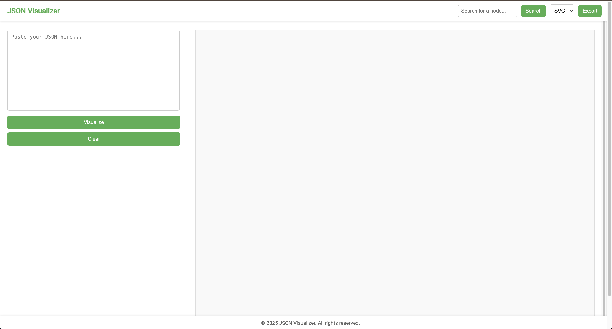

# JSON Visualizer

A web-based tool to visualize JSON data as an interactive hierarchical tree. Built with **D3.js**, this application allows users to input JSON, visualize it, search for nodes, and export the visualization as SVG, PNG, or JPG.

 <!-- Add a screenshot if available -->

## Features

- **Visualize JSON**: Convert JSON data into an interactive tree structure.
- **Search Nodes**: Highlight and zoom to specific nodes by name.
- **Export Visualization**: Export the tree as SVG, PNG, or JPG.
- **Customizable Nodes**: Adjust the size of nodes dynamically.
- **Collapsible Tree**: Expand or collapse nodes for better navigation.
- **Responsive Design**: Works on both desktop and mobile devices.

## Technologies Used

- **HTML/CSS**: For the structure and styling of the application.
- **JavaScript**: For interactivity and logic.
- **D3.js**: For rendering the hierarchical tree.
- **canvg**: For exporting the visualization as PNG or JPG.

## Getting Started

### Prerequisites

- A modern web browser (Chrome, Firefox, Safari, Edge, etc.).
- Basic knowledge of JSON.

### Installation

1. **Clone the Repository**:
   ```bash
   git clone https://github.com/Rajesh1761/json-visualizer.git
   cd json-visualizer
